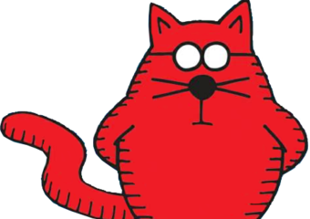
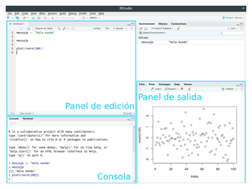
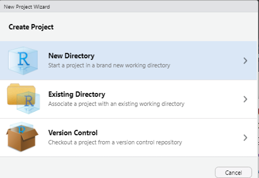
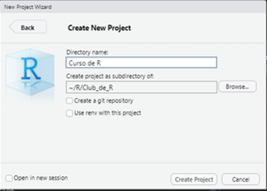
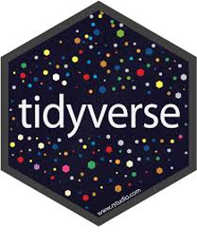
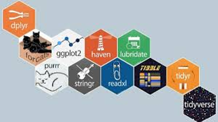
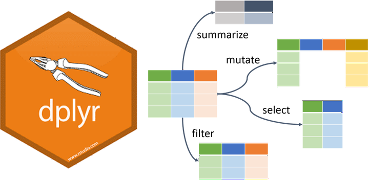
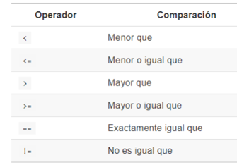

class: inverse, top, center
background-image: url(Archivos/portada.png)
background-size: cover

```{r setup, include=FALSE}
options(htmltools.dir.version = FALSE)
```

---
class: inverse

## Antes de empezar

Si quieren compartir imágenes del curso en redes sociales lo pueden hacer, tanto si les gustó como si no les gustó.

--

.pull-left[
Los hashtags que pueden usar son 
* ### #R4HR 
* ### #RStats_ES 
* ### #data4hr 
* ### #BetterWithData
* ### #PeopleAnalytics 
* ... y el hashtag que quieran


También pueden arrobar a Data 4HR y unirse a los grupos

`r icon::fa("facebook")` [Freakys de RRHH](https://www.facebook.com/groups/freakysderrhh)

`r icon::fa("slack")` [Slack R4HR](https://join.slack.com/t/r4hr/shared_invite/zt-geqfwra8-iZv3G5admNbyuej2gyFQDg)

]

.pull-right[

]


---

## Antes de empezar

Algunas cosas que tienen que saber:

* El link de Zoom va a ser siempre el mismo. `r emo::ji("artificial_satellite")`

--

* No hace falta que tengan la cámara encendida. `r emo::ji("detective")`

--

* Las clases las grabo y las comparto de manera privada por Youtube. `r emo::ji("movie_camera")`

--

* Vamos a usar documentos compartidos para tomar notas. `r emo::ji("open_book")`

--

* Súmense al grupo de [Slack](https://join.slack.com/t/r4hr/shared_invite/zt-geqfwra8-iZv3G5admNbyuej2gyFQDg) ya que todas las consultas las hacemos por ahí. `r emo::ji("fist_right")``r emo::ji("fist_left")`

--

* Pueden interrumpir las veces que quieran. `r emo::ji("raising_hand")`


---

# Clase 1 - Introducción a R y Tidyverse
## R

R es un lenguaje de código abierto, creado principalmente para el análisis estadístico de datos.

Su popularidad se debe gracias a la enorme comunidad global que permanentemente actualiza paquetes, y genera contenido. Aparte de los desarrollos de machine learning que se hacen en todo el mundo, te podés encontrar con:

--

* La [BBC](https://github.com/bbc/bbplot) y [The Economist](http://rstudio-pubs-static.s3.amazonaws.com/284329_c7e660636fec4a42a09eed968dc47f32.html) construyendo paquetes y *temas* para los gráficos.

--

* [Airbnb](https://peerj.com/preprints/3182.pdf) usándolo para sus investigaciones, modelos y reportes.

--

* Yo lo uso para los informes de nuestros proyectos...

--

.right[... y para hacer estas presentaciones `r emo::ji("+1")`]

---

## Ventajas de R

Aprender R para RRHH tiene inagotables ventajas:

* Hacer análisis predictivos (Clase 3 de este curso!)
* Reproducir el trabajo
* Más capacidad de procesamiento que Excel
* Automatizar el trabajo
* Analizar **todo** tipo de datos
  * Tablas
  * Bases de Datos, Sistemas de Gestión
  * Texto libre
  * Imágenes
* Enviar mails con reportes automáticos
* Escribir libros, blogs, CV
* La comunidad de R

---
## La comunidad de R

R cuenta con una red de soporte muy amplia, sólida y solidaria, especialmente en Latinoamérica. Prácticamente en todos los países del continente hay RUG (R Users Group) para el público en general, y toda una red de R-Ladies que promueven la diversidad de mujeres y de minorías, para generar mejores oportunidades laborales.


Pueden explorar todos los RUG [https://benubah.github.io/r-community-explorer/rladies.html](https://benubah.github.io/r-community-explorer/rladies.html)

---
## El Club de R para RRHH
<br><br>

.pull-left[

]

En esta misma línea, desde Mayo de 2020 empezamos a desarrollar una comunidad específica para el mundo de RRHH, donde nos reunimos el primer sábado de cada mes los sábados de 10:00 a 11:30 hs. (hora de Argentina) para aprender a programar en este lenguaje.

Revisamos paquetes, exploramos formas de hacer análisis predictivos, y el plan es poder desarrollar una red similar a los RUGs y R-Ladies.


> **Todo el contenido generado por mí en el Club lo pueden usar para sus propios grupos y cursos**

---
## Aprender a programar

Al principio programar es un acto de fe. Vemos que pasan cosas, que escribo algo y una cosa aparece en la pantalla pero no sabemos por qué, cómo, y por qué no me sale de nuevo.

En particular R, y sus paquetes, permiten expresar lo que quiero programar mayormente de una forma similar a la que lo haría si tuviera que dar las instrucciones verbalmente a alguien. Y a diferencia de otros lenguajes como html por ejemplo, la sintaxis del código (las instrucciones) es mucho más simple (entren a cualquier página web y aprieten F12).

También les va a pasar con este curso que muchas cosas les va a resultar más sencillas de hacer en Excel. O que tal vez buscando en internet encontraste otra forma de hacer las cosas, y está bien que así sea.

Lo único que van a necesitar para programar es:

* Paciencia
* Constancia
* Curiosidad

Y con el tiempo, y la práctica, un día tenés una epifanía y todo lo que volcas en un código cobra sentido.


---
class: inverse, center, middle
# Basta de cháchara!


---
# El lenguaje R


En rigor a la verdad, R es un **lenguaje**, no un programa. Lo que escribimos en la consola de R (de ahora en adelante, el *script*) son las instrucciones para que la computadora ejecute lo que le pedimos.

--

Usamos *RStudio* porque nos facilita seguir el código, ver y copiar los resultados, gestionar los archivos de fuentes de datos, ver los gráficos, etc..

--

.center[

]
---
class: inverse, center, middle
# Personalizando RStudio

   
---


# El lenguaje R
## Proyectos

Trabajar con proyectos en RStudio hace que todo el trabajo sea más sencillo. Los proyectos crean una carpeta en nuestra PC en donde se almacenarán los archivos, tablas, scripts, y hace que todo sea más organizado.

--

Para crear un proyecto tenés podés entrar en:
* *File*
  * *New project*

Y luego poner el nombre de la carpeta.

.pull-left[]


.pull-rigt[]

---

# El lenguaje R
## Objetos

--

Por definición, R es un lenguaje *orientado a objetos*. Esto significa que a una tabla, un valor, una variable, etc. le voy a poner un nombre, y esa cosa que ahora tiene nombre se llama **objeto**.

Esto nos simplifica un montón la vida. La asignación la hacemos con el símbolo `<-` que simula una flecha hacia la izquierda. También se puede hacer con el símbolo `=` pero como muchas veces lo utilizamos para configurar un parámetro de una función usamos *"la flechita"*. 

```{r}
# Esto es un comentario

objeto_1 <- 1979
objeto_2 <- 2020-1979

# Para ver el resultado del objeto uso las teclas Ctrl + Enter
# También puedo usar el ícono  "Run"
objeto_1
objeto_2

```

---
## Tipos de objetos

Tenemos varios tipos de objetos. Uno de los objetos más utilizados son los **vectores** que son conjuntos de valores, numéricos, de texto, o combinados.

```{r}
# Vector de Texto
nombres <- c("John", "Mike", "Ringo", "George") 
nombres
# Las variables de texto van siempre con comillas.

# Cambiar un elemento del vector 
nombres[2] <- "Paul"
nombres

# Vector numérico
anio_nacimiento <- c(1940, 1942, 1940, 1943)
viven <- c(0,1,1,0)

```


---

## Dataframes

Vamos a llamar **dataframe** a los *datasets*, a las tablas que contienen nuestros datos. Al igual que una planilla de cálculo, tiene filas y columnas.

Podemos crear dataframes con los vectores que tengan la misma cantidad de objetos.

```{r}
instrumentos <- c("guitar", "bass", "drums", "piano")

# Crear un dataframe con los vectores
beatles <- data.frame(nombres, instrumentos, anio_nacimiento, viven) #<<

beatles
```

---
## Dataframes

.pull-left[Para acceder a un elemento de un dataframe tenemos que usar la siguiente lógica:

`nombre_dataframe[fila, columna]`

```{r}
beatles[1,3]
```

--

Si queremos elegir toda una fila dejamos el espacio de la columna vacío
```{r}
beatles[3,]
```
]

--

.pull-right[
Lo mismo para seleccionar una columna
```{r}
beatles[,3]
```

--

Y si quiero cambiar un elemento puntual puedo hacerlo de la siguiente manera
```{r}
beatles[4,2] <- "guitar"
beatles
```

]

---

## Dataframes

Para seleccionar más de una columna podemos hacerlo de dos maneras:

1. Si son columnas contiguas usando `:`.

```{r}
beatles[,2:4]
```

--

Si las columnas no están contiguas.
```{r}
beatles[, c(2, 4)]
```

--

También podemos usar los nombres de las variables. No olviden las comillas!

```{r}
beatles[,c("nombres", "viven")]
```


---
# El lenguaje R
## Paquetes

Los paquetes son *"programitas"* que amplían las capacidades de R para hacer cosas específicas, simplificando la programación.

--

La mayoría de los paquetes son curados por [CRAN](https://cran.r-project.org/) y se instalan de manera muy simple con la función `install.packages()`.

```{r eval=FALSE}
install.packages("openxlsx")
```

Las comillas son muy importantes

--

La instalación se hace una sola vez. Para usarlo, cada vez que abrimos el *script* tenemos que cargarlo con la función `library()`. A diferencia de la instalación, no hace falta las comillas. 

```{r}
library(openxlsx)
```

---
# El lenguaje R
## Carguemos nuestro primer archivo

Para cargar archivos en R, una buena práctica es asignar el dataset, o conjunto de datos, a un objeto.
```{r}
nomina <- read.xlsx("Nomina.xlsx")
```

--

Ahora, a explorarlo. Podemos ver las primeras filas con la función `head()`.

```{r}
head(nomina)
```

---
## Explorando el dataset

Ver la cantidad de filas y columnas:

```{r}
str(nomina)
```

--

Los nombres de las variables.

```{r}
names(nomina)
```


---

## Explorando el dataset

Otra función muy utilizada de R es `summary()`.

```{r}
summary(nomina)
```

---

## Explorando el dataset

La función summary nos muestra, de las variables numéricas:

* El valor mínimo
* 1er. y 3er. cuartil
* Mediana
* Promedio (mean)
* El valor máximo

--

De las variables de tipo texto, como es de tipo `character` sólo nos indica la cantidad de observaciones. Si la cambiamos a tipo `factor` podemos obtener otra información.

```{r}
# Cambiamos el tipo de variable de 'character' a 'factor'
nomina$ESTADO_CIVIL <- as.factor(nomina$ESTADO_CIVIL)

summary(nomina$ESTADO_CIVIL)
```

---

## Explorando los datos

También existen paquetes especiales, como `funModeling`y `tidyverse` que tienen funciones para explorar datos.

El paquete funModeling fue desarrollado por [Pablo Casas](https://www.linkedin.com/in/pcasas/) de la [Escuela de Datos Vivos](https://escueladedatosvivos.ai/courses).

```{r message=FALSE, warning=FALSE}
library(funModeling)

status(nomina)
```


---

# El paquete tidyverse

RStudio además de desarrollar la IDE para usar R, es también uno de los principales desarrolladores de paquetes.

Uno de sus paquetes, que engloba varios paquetes, se convirtió en un estándar de la limpieza y transformación de datos, que es **tidyverse**. A este estándar de limpieza de datos se lo llama *tidy data*, en donde entre sus principios dice:

> Cada variable forma una columna.

> Cada observación tiene que estar en una fila.

.right[]

---

# El paquete tidyverse

.center[]

Tidyverse es un paquete que engloba varios paquetes, todos muy utilizados, a veces declarativamente, otras veces R lo usa detrás de escenas. En esta sesión vamos a usar principalmente los paquetes **dplyr** y **ggplot2**. Primero hay que instalar el paquete y luego cargarlo

```{r eval=FALSE}
install.packages("tidyverse")
```
```{r}
library(tidyverse)
```


---

# El paquete tidyverse

Una de las razones por las cuales tidyverse se hizo tan popular es que la lógica de las funciones imita el razonamiento que haríamos verbalmente.

--

Por ejemplo, ¿cómo harían para calcular la edad promedio por área?

--

```{r}
nomina %>% 
  select(AREA, EDAD) %>% # Selecciona las columnas
  group_by(AREA) %>%     # Agrupa por la variable AREA
  summarise(edad_promedio = mean(EDAD)) %>% # Crea una variable con la edad promedio
  arrange(-edad_promedio) # Ordena descendentemente los resultados por la variable que pasemos.
```

---

# El paquete tidyverse
## dplyr

¿Vieron este símbolo `%>%` en la slide anterior? En la jerga lo conocemos como *"pipe"* (atajo de teclado Ctrl + Mayús + M). Lo que nos permite este *"tubo"* es ordenar el código en secuencias, haciéndolo más comprensible a la lectura.

Una de las ventajas del *pipe* es que no necesitamos invocar al dataframe en cada función que encadenamos en el pipe.

.center[

]

---

## dplyr

Por ejemplo, queremos ver los empledos que tienen hijos por cada área. Los pasos son:

1. Elegir las variables AREA, ID, HIJOS.
2. Filtrar de la variable HIJOS los casos en que sí tengan hijos.
3. Ordenar los resultados por área.

> Acá estoy usando la función `head()` para que quede prolijo en la presentación. Ustedes no la usen y recuerden sacar el último paréntesis

```{r}
head(arrange(filter(select(nomina, AREA,ID, HIJOS), HIJOS > 0), AREA))
```

---

## dplyr

Esto mismo usando el pipe de dplyr lo hacemos así:
```{r}
nomina %>%
  select(AREA, ID, HIJOS) %>%
  filter(HIJOS>0) %>%
  arrange(AREA) %>% 
  head()
```

---

class: inverse, middle
background-image: url("Archivos/dplyr.png")
background-size: cover


---
# Las funciones de dplyr

Habitualmente a las funciones del paquete dplyr las llamamos *verbos*. Para muchos paquetes desarrollados por RStudio existe un *cheat sheet* o guía de referencia para ayudarnos a recordar las funciones más utilizadas y se encuentran en este link de [su página](https://rstudio.com/resources/cheatsheets/).

En la sección *Translations* podemos encontrar muchos cheat sheets en español. Acá pueden descargar el de [transformación de datos](https://github.com/rstudio/cheatsheets/raw/master/translations/spanish/data-transformation_Spanish.pdf) que veremos hoy.

---
# Las funciones de dplyr
## select()

La función select() sirve para elegir las columnas (variables) con las que queremos trabajar. También nos permite traer las columnas en el orden que las necesitemos.

```{r}
nomina %>% 
  select(AREA, ID, HIJOS) %>% #<<
  head()
```

---

## select()

select() tiene algunas variantes interesantes (y en general aplican para casi todas las funciones de dplyr).

Supongamos que quiera seleccionar todas las columnas numéricas nada más:


```{r}
nomina %>%
  select_if(is.numeric) %>% #<<
  head()
```

---

## filter()

.pull-left[
`filter()` nos permite obtener las filas (observaciones) que cumplen con las condiciones que necesitamos.

Empleados que tienen hijos

```{r}
nomina %>%
  select(ID, HIJOS) %>% 
  filter(HIJOS > 0) %>% #<<
  head()
```

]

.pull-right[
Estas son los operadores lógicos que nos van a ayudar con la función filter.


]

---

## filter()

filter() nos permite obtener las filas (observaciones) que cumplen con las condiciones que necesitamos.

Empleados con antigüedad menor al año, del sector INSERTOS.

```{r}
nomina %>%
  filter(ANTIGUEDAD < 1 & AREA == "INSERTOS") #<<
```

---
## filter()

filter() nos permite obtener las filas (observaciones) que cumplen con las condiciones que necesitamos.

Empleados de dos áreas diferentes
```{r}
nomina %>%
  filter(AREA == "FINANZAS"| AREA == "RRHH") #<<
```
 
--

Una alternativa es usar un vector de selección
```{r eval = FALSE}
nomina %>%
  filter(AREA %in% c("FINANZAS", "RRHH")) #<<
```

---

## arrange()

`arrange()` ordena las variables de acuerdo al criterio que queramos. Por default, ordena los datos ascendentemente.

.pull-left[
Ordenar los empleados por edad

```{r}
nomina %>% select(ID, EDAD, AREA) %>%
  arrange(EDAD) %>% #<< 
  head()
```

]

--

.pull-right[
La función `arrange()` también se puede usar con variables de texto.

```{r}
nomina %>% select(ID, AREA, N_CATEG) %>%
  arrange(AREA) %>% #<<
  head()
```

]

---
## arrange()

Para ordenar los datos ascendentemente hay dos alternativas.

.pull-left[
Con la función `desc()`.

```{r}
nomina %>%
  select(ID, EDAD) %>%
  arrange(desc(EDAD)) %>%  #<<
  head()
```

]

--

.pull-right[
Con el signo menos `-`.
```{r}
nomina %>%
  select(ID, ANTIGUEDAD) %>%
  arrange(-ANTIGUEDAD)  %>% #<<
  head()
```

]

---

## group_by()

`group_by()` es una función para agrupar las variables en función de los valores de una de las columnas. Por ejemplo si quiero ver la antigüedad por área.

```{r}
nomina %>%
  select(AREA, ANTIGUEDAD) %>%
  group_by(AREA) %>% #<<
  head()
```

---

## summarise()

`summarise()` se usa para crear nuevas columnas con medidas de resumen estadístico. Se suele usar mucho en conjunto con group_by().

Por ejemplo si quiero calcular la antigüedad promedio por área:

```{r}
nomina %>%
  select(AREA, ANTIGUEDAD) %>%
  group_by(AREA) %>%
  summarise(Ant_Promedio = mean(ANTIGUEDAD)) %>% #<<
  head()
```

---

## mutate()

`mutate()` se usa para crear una nueva columna, a partir de las columnas que ya existen.

Hagamos un cálculo loco, creemos una columna nueva que calcule la diferencia entre la edad y la edad promedio de la empresa

```{r}
nomina %>%
  select(ID, EDAD) %>%
  mutate(Diferencia_Edad = EDAD - mean(EDAD)) %>% #<<
  head()
```

---

## rename()

Muchas veces los nombres de las tablas vienen con nombres poco comprensibles si no estás familiarizado, `rename()` te permite cambiar el nombre de una variable.

Su sintaxis es:

--

1. Nombre nuevo de la variable

--

2. Nombre original de la variable

```{r}
nomina <- nomina %>%
  rename(CATEGORIA = N_CATEG) #<<

names(nomina)
```

---
class: inverse, middle

# Secuencia de análisis

## 1. Agrupar los grupos que quiero comparar (group_by)
## 2. Calcular medidas de resumen estadístico (summarise, mutate)
## 3. Graficar los resultados (ggplot)

---

# Unir datos de diferentes tablas

.pull-left[
La función `join() nos permite unir distintas tablas que contengan alguna columna en común.
]

.pull-right[

]

---

# Unir datos de diferentes tablas
# left_join()

La función `left_join()` une al dataframe de la izquierda, las coincidencias que obtengamos del dataframe de la derecha.

--

Primero, creemos un nuevo dataframe con los datos que están en la segunda pestaña del archivo Nomina.xlsx usando el parámetro `sheet`.

```{r}
puestos <- read.xlsx("Nomina.xlsx", sheet = "Puestos")

# Usemos una función de tidyverse para explorar el dataframe
glimpse(puestos)
```


---

## left_join

Ahora que tenemos dos dataframes, podemos unir la información que necesitamos.

En de la función `left_join()` **dentro del pipe** primero tenemos que poner el nombre del dataframe que vamos a buscar los datos que necesitamos, y que coinciden con el primer dataset (`nomina`), y luego uso el parámetro `by` para indicar la variable que vamos a usar para unir los datos.

Esta es una función análoga al *buscarv* de Excel. Para ampliar los conocimientos sobre los *joins* les recomiendo esta presentación de [Patricia Loto](https://patricialoto-relationaldatawithdplyr.netlify.app/#20).

```{r}
# Primero el nombre del dataframe, luego la variable de unión.
nomina_full <- nomina %>% 
  left_join(puestos, by = "ID") #<<

glimpse(nomina_full)
```


---
# Nuestro primer análisis

El dataset nuevo tiene los sueldos de algunos empleados, los mensualizados. Por eso tenemos en las nuevas variables `PUESTO` y `SUELDO` unos registros con datos nulos, y que figuran como `NA`.

Así que para nuestro primer análisis podemos crear un objeto nuevo, que lo llamaremos `mensuales` filtrando los datos nulos.

```{r}
# Filtramos todas las filas con NA en el campo PUESTO
mensuales <- nomina_full %>% 
  filter(!is.na(PUESTO)) #<<

glimpse(mensuales)
```

---
# Nuestro primer análisis

Ahora que tenemos un dataset más limpio podemos hacer nuestro primer análisis. Por ejemplo, calcular el sueldo promedio por puesto.

```{r}
sueldos_promedios <- mensuales %>% 
  select(PUESTO, SUELDO) %>% 
  group_by(PUESTO) %>% #<<
  summarise(sueldo_promedio = mean(SUELDO)) #<<

sueldos_promedios
```

---

# Nuestro primer análisis

.pull-left[
Y ahora podemos graficar los resultados usando el paquete `ggplot2` que ya está cargado dentro de `tidyverse`.

La sintaxis es:

1. La función ggplot
2. El dataframe a graficar
3. Las variables a graficar
4. El tipo de gráfico

```{r sueldos, fig.show= 'hide'}
ggplot(sueldos_promedios, aes(x = PUESTO, y = sueldo_promedio)) +
  geom_col()
```

]

.pull-right[

```{r ref.label = 'sueldos', echo=FALSE, message=FALSE, warning=FALSE, out.widht="50%"}
```

]

---
# Nuestro primer análisis
## Mejoremos el gráfico

.pull-left[
```{r sueldo2, fig.show= 'hide'}
ggplot(sueldos_promedios, 
       aes(x = reorder(PUESTO, sueldo_promedio), # Ordena el gráfico por sueldos_promedios 
           y = sueldo_promedio)) + 
  geom_col() +
  coord_flip() + # Rota  el gráfico
  labs(title = "Sueldos Promedios por Puesto", 
       subtitle = "Año 2016",
       x = "Puesto",
       y = "Sueldo Promedio",
       caption = "Datos: Curso Introducción a R para RRHH") +
  theme_minimal()
  
```

]

.pull-right[

```{r ref.label = 'sueldo2', echo=FALSE, message=FALSE, warning=FALSE, out.widht="50%"}
```

]

---

# Ejercicios

.pull-left[
1. Calcular el desvío estándar de los sueldos por área con las funciones `summarise()` y `sd()`.
2. ¿Cuántos empleados no tienen hijos?
3. Del archivo "HRDataset_v13.csv", ¿cuáles son las fuentes de reclutamiento (`RecruitmentSource`) de donde se hayan los empleados con mejor score de performance `PerfScoreID`?

]

.pull-right[

]


---
class: inverse, center, bottom

Presentación realizada con el paquete [Xaringan](https://github.com/yihui/xaringan) desarrollado por Yihui Xie.

Gracias a [Patricia Loto](https://twitter.com/patriloto) por compartir el [tutorial](https://twitter.com/patriloto/status/1260822644590608391?s=20)

