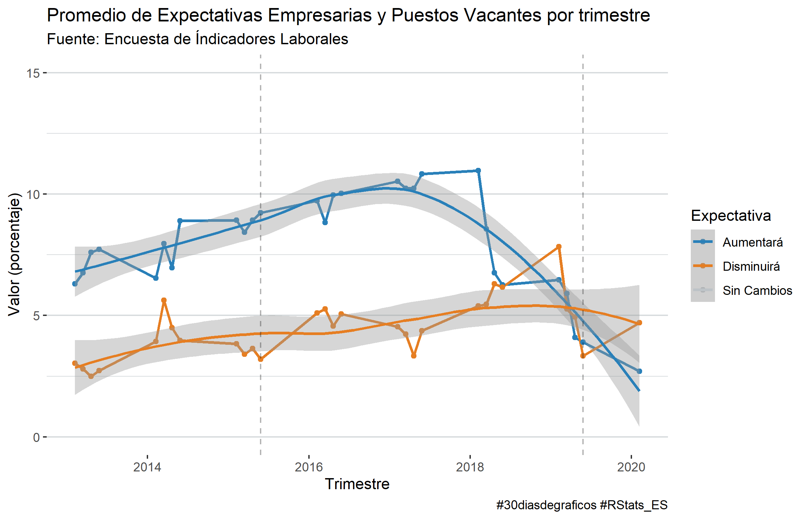
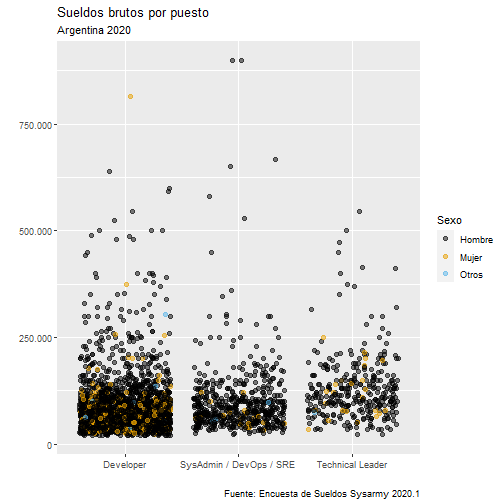
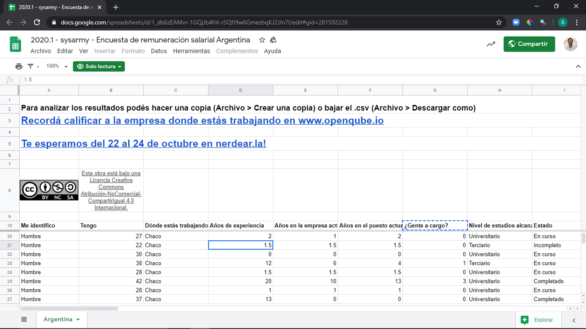

class: inverse, top, center
background-image: url(Archivos/portada.png)
background-size: cover

```{r setup, include=FALSE}
options(htmltools.dir.version = TRUE)
```

---

# Clase 2 - Haciendo gráficos en R
## ggplot2

**ggplot2** es uno de los paquetes que está dentro de *tidyverse* y es el paquete más utilizado para hacer gráficos.

.pull-left[

]

.pull-right[

]

---
class: inverse
# Pero antes...

--

### ¿Cómo les fue con los ejercicios?

.right[

]


---

# Como los resolví yo

```{r echo=FALSE, message=FALSE, warning=FALSE}
library(tidyverse)
library(openxlsx)

nomina <- read.xlsx("Datasets/Nomina.xlsx")
puestos <- read.xlsx("Datasets/Nomina.xlsx", sheet = "Puestos")

mensuales <- nomina %>% 
  left_join(puestos, by = "ID") %>% 
  filter(!is.na(PUESTO))
```

### 1. Calcular el desvío estándar de los sueldos por área con las funciones `summarise()` y `sd()`.

```{r}
mensuales %>% 
  select(AREA, SUELDO) %>% 
  group_by(AREA) %>% 
  summarise(Dispersion_Salarial = sd(SUELDO)) %>% 
  arrange(Dispersion_Salarial)
```

---

### 2. ¿Cuántos empleados no tienen hijos?

```{r}
nomina %>% 
  filter(HIJOS == 0) %>% 
  tally() # Es una función para contar los resultados
```

--

Con una función de `funModeling` también podíamos responderlo fácil, ¿se acuerdan cuál es?

--

```{r message=FALSE, warning=FALSE}
library(funModeling)

status(nomina)
```

---

### Del archivo "HRDataset_v13.csv", ¿cuáles son las fuentes de reclutamiento (`RecruitmentSource`) de donde se hayan los empleados con mejor score de performance `PerfScoreID`?

Primero, cargo el archivo
```{r message=FALSE, warning=FALSE}
library(readr)

hr_data <- read_delim("HRDataset_v13.csv", delim = ";")

dim(hr_data)
```

--

Luego, hago un `group_by` y uso `summarise` y `arrange` para responder el ejercicio.

```{r}
hr_data %>% 
  select(RecruitmentSource, PerfScoreID) %>% 
  group_by(RecruitmentSource) %>% 
  summarise(performance_promedio = mean(PerfScoreID)) %>% 
  arrange(-performance_promedio)
```

---

# Guardar archivos

El paquete `openxlsx` también permite grabar los dataframes en un archivo de Excel.

```{r eval=FALSE}
write.xlsx(x = perf_by_source, file = "desempeño_por_fuente.xlsx")
```

---
class: inverse, center, middle

## ¿Qué problemas tuvieron con la práctica?


---

# Haciendo gráficos con ggplot2

El paquete *ggplot2* es uno de los paquetes de *tidyverse*, y que está basado en la teoría de **"grammar of graphics"** (la gramática de los gráficos), porque permite construir los gráficos por capas, controlando las características individuales de cada uno.

--


--

Esto implica que podemos controlar desde la **estructura** del gráfico (títulos, ejes) hasta todo lo que pasa dentro de la **visualización**.

---
# La gramática de los gráficos
## Las capas de ggplot2

En **ggplot2** las capas que podemos controlar:

--

* **Datos**: Cuál es el conjunto de datos que vamos a visualizar.

--

* **Aesthetics**: Acá volcamos las variables que vamos a graficar y que vamos a *mapear* en los ejes.

--
* **Geometría**: Es la forma geométrica (*geom*) que va a tomar la representación de los datos en la visualización (líneas, barras, puntos, etc.).

--

Estos son los elementos básicos para hacer un gráfico.

---

# La gramática de los gráficos
## Las capas de ggplot2

Otros elementos que podemos controlar con **ggplot2** son:

--

* **Facets**: Los *facets* nos permiten separar un mismo gráfico por categorías (por ejemplo, pensando en datos de RRHH unidades de negocio, países, áreas, etc.).

--

* **Estadística**: Podemos incluir dentro de los gráficos algún elemento que represente un cálculo estadístico, como ser promedios o regresiones lineales por ejemplo.

--

* **Coordenadas**: Nos permiten controlar la orientación de los gráficos, por ejemplo para hacer más legibles los ejes.

--

* **Temas**: En *themes* podemos controlar todos los aspectos estéticos de un gráfico, tanto de la estructura como de la visualización.

---
# Haciendo gráficos en ggplot2

La sintaxis básica para hacer cualquier gráfico en ggplot2 es la siguiente:

```{r eval=FALSE}
ggplot(data, aes(x,y)) + #<<
  geom_col() #<<
```

--
Para hacer un gráfico mínimamente necesitamos:

* data: La fuente de datos.
* aes: Las variables a graficar
* geom: El tipo de gráfico que vamos a hacer.

--

Instalar y cargar este paquete es igual que con el resto de los paquetes
```{r eval=FALSE}
install.packages("ggplot2")
library(ggplot2)
```

> Nota: Si ya tenemos instalado tidyverse, no es necesario volver a instalar ggplot2, porque es uno de los paquetes que está integrado dentro de tidyverse.

---
# Gráficos básicos en ggplot2
## El dataset

Antes de empezar, cargamos el dataset.
```{r eval = FALSE}
library(tidyverse)
library(openxlsx)

nomina <- read.xlsx("Nomina.xlsx")
puestos <- read.xlsx("Nomina.xlsx", sheet = "Puestos")

# Unifico los datasets y filtro los casos nulos de la columna PUESTO
mensuales <- nomina %>% 
  left_join(puestos, by = "ID") %>% 
  filter(!is.na(PUESTO))
```

---

# Gráficos básicos en ggplot2
## El dataset

Vamos a hacer un par de modificaciones al dataframe. Vamos a crear rangos de edad, y ordenarlos. También vamos a modificar el estado civil para hacerlo más legible.

```{r}
mensuales <- mensuales %>% 
  mutate(Rangos_Edad = case_when(
    EDAD %in% 18:30 ~ "Hasta 30",
    EDAD %in% 31:40 ~ "Entre 31 y 40",
    EDAD %in% 41:50 ~ "Entre 41 y 50",
    EDAD %in% 51:70 ~ "Más de 50"),
    Rangos_Edad = factor(Rangos_Edad, levels = c("Hasta 30", "Entre 31 y 40",
                                                 "Entre 41 y 50", "Más de 50")))
```

---
# Gráficos básicos en ggplot2
## Histogramas

Los histogramas son gráficos que nos permiten crear un gráfico de barras, en la que cada barra representa un rango de valores. Es muy útil para conocer la **distribución** de una variable numérica.

---

# Gráficos básicos en ggplot2
## Histogramas

.pull-left[
```{r hist-basico, fig.show= 'hide'}
ggplot(mensuales, aes(SUELDO)) +
  geom_histogram() #<<
```
]

.pull-right[
```{r ref.label = 'hist-basico', echo=FALSE, message=FALSE, warning=FALSE}
```
]

---
# Gráficos básicos en ggplot2
## Histogramas

Por default, ggplot2 intenta representar los datos en *"cajones"* (bins). Podemos modificar la cantidad de bins con el parámetro **bins** por ejemplo.

Y si queremos controlar el rango de cada bin, podemos usar el parámetro **bindwidth**.

```{r echo = FALSE, out.width="35%"}
ggplot(mensuales, aes(SUELDO))+
  geom_histogram(bins = 15)+
  ggtitle("bins = 15")

ggplot(mensuales, aes(SUELDO))+
  geom_histogram(binwidth = 5000)+
  ggtitle("bindwidth = 5000")
```

---

# Gráficos básicos en ggplot2
## Gráficos de Densidad

.pull-left[
Los gráficos de densidad son una alternativa a los histogramas, pero nos ayudan a representar la distribución.

```{r densidad-basico, fig.show= 'hide'}
ggplot(mensuales, aes(SUELDO)) +
  geom_density(color="blue", fill="blue", alpha=0.3) #<<
```
]

.pull-right[
```{r ref.label = 'densidad-basico', echo=FALSE, message=FALSE, warning=FALSE}
```
]


---
# Gráficos básicos en ggplot2
## Boxplots

Los boxplots son gráficos que contienen una gran cantidad de información estadística.


En este gráfico podemos ver:

* Los cuartiles 1 y 3 (Q1 y Q3) en los bordes de la caja.
* La mediana que es la linea dentro de la caja.
* Los outliers, representados en puntos, que son observaciones que superan una vez y media (1,5 veces) el rango intercuartil.

---

# Gráficos básicos en ggplot2
## Boxplots

.pull-left[
```{r boxplot-basico, fig.show= 'hide'}
ggplot(mensuales, aes(SUELDO)) +
  geom_boxplot() #<<
```
]

.pull-right[
```{r ref.label = 'boxplot-basico', echo=FALSE, message=FALSE, warning=FALSE}
```
]

---
class: inverse

# PAUSA!!!


---
# Gráficos básicos en ggplot2
## Barras

Los gráficos de columna son uno de los tipos de gráficos más populares por su sencilla interpretación, y la rápida comparación entre resultados, gracias a que es muy fácil comparar el largo de las barras.

En ggplot2 existen dos *geoms* para hacer gráficos de barras: *geom_col* y *geom_bar*. La diferencia entre uno y otro es que *geom_col* permite visualizar el valor de las observaciones, mientras que *geom_bar* cuenta la cantidad de filas en las que aparece cada observación.

---

# Gráficos básicos en ggplot2
## Barras

```{r echo = FALSE, message=FALSE, warning=FALSE, out.width="50%"}
mensuales %>%
  group_by(PUESTO) %>%
  summarise(Sueldo_Promedio = mean(SUELDO)) %>%
  ggplot(aes(x = PUESTO, y = Sueldo_Promedio))+
  geom_col()+ ggtitle("geom_col") +
  theme(axis.text.x = element_text(angle = 90))

ggplot(mensuales, aes(x = PUESTO))+
  geom_bar()+ ggtitle("geom_bar")+ 
  theme(axis.text.x = element_text(angle = 90))
```

---

# Gráficos básicos en ggplot2
## Barras con geom_bar

.pull-left[
En esencia, con geom_bar, lo que podemos hacer es **contar** cantidad de veces que se repite un valor dentro de una columna. Hay algunas variantes, por ejemplo apilar los segmentos:
```{r bar-pila, fig.show= 'hide'}
ggplot(mensuales, aes(x = AREA, fill = Rangos_Edad))+
  geom_bar() + #<<
  theme(axis.text.x = element_text(angle = 90))+
  ggtitle("Empleados por rango de edad por área")
```
]

.pull-right[
```{r ref.label = 'bar-pila', echo=FALSE, message=FALSE, warning=FALSE}
```
]

---

# Gráficos básicos en ggplot2
## Barras con geom_bar

Algo muy útil en los geom_bar es la posibilidad de hacer un gráfico calculando la proporción de cada categoría agregando *position = "fill"*-

.pull-left[
```{r bar-fill, fig.show= 'hide'}
ggplot(mensuales, aes(x = AREA, fill = Rangos_Edad))+
  geom_bar(position = "fill") + #<<
  theme(axis.text.x = element_text(angle = 90))+
  ggtitle("Proporción de rangos de edad por área")
```
]

.pull-right[
```{r ref.label = 'bar-fill', echo=FALSE, message=FALSE, warning=FALSE}
```
]

---
# Gráficos básicos en ggplot2
## Barras con geom_bar

.pull-left[
También podemos posicionar una barra al lado de la otra con *position = "dodge"*

```{r bar-dodge, fig.show= 'hide'}
mensuales %>%
  filter(AREA %in% c("LAMINADO", "TEMPLADO")) %>%
  ggplot(aes(x = AREA, fill = Rangos_Edad))+
  geom_bar(position = "dodge")+ #<<
  ggtitle("Rangos de edad en Laminado y Templado")
```
]

.pull-right[
```{r ref.label = 'bar-dodge', echo=FALSE, message=FALSE, warning=FALSE}
```
]

---
# Gráficos básicos en ggplot2
## Barras con geom_col

Con los gráficos de columna podemos graficar el valor de cada observación, independientemente de la cantidad de veces que se repita la fila en el dataset.

Cuando usamos geom_col es necesario indicar la variable en **x**, y también en **y**.

.pull-left[
```{r col-basico, warning = FALSE, message=FALSE,  fig.show= 'hide'}
mensuales %>%
  group_by(PUESTO) %>%
  summarise(Sueldo_Promedio = mean(SUELDO)) %>%
  ggplot(aes(x = PUESTO, y = Sueldo_Promedio))+ #<<
  geom_col()+ #<<
  ggtitle("Sueldos promedios por puestos")+
  theme(axis.text.x = element_text(angle = 90))
```
]

.pull-right[
```{r ref.label = 'col-basico', echo=FALSE, message=FALSE, warning=FALSE}
```
]


---

# Gráficos básicos en ggplot2
## Barras con geom_col

Para facilitar la lectura del gráfico de barras, y siempre y cuando la variable categórica no sea ordinal, es una buena práctica ordenar las barras de mayor a menor para facilitar la comprensión del gráfico. Esto lo podemos hacer con la función **reorder**.

.pull-left[
```{r col-order, warning=FALSE, fig.show= 'hide'}
mensuales %>%
  group_by(PUESTO) %>%
  summarise(Sueldo_Promedio = mean(SUELDO)) %>%
  ggplot(aes(x = reorder(PUESTO, -Sueldo_Promedio), y = Sueldo_Promedio))+ #<<
  geom_col()+
  ggtitle("Sueldos promedios por puesto")+
  theme(axis.text.x = element_text(angle = 90))
```
]

.pull-right[
```{r ref.label = 'col-order', echo=FALSE, message=FALSE, warning=FALSE}
```
]

---
# Gráficos básicos en ggplot2
## Líneas

Los gráficos de línea por naturaleza se usan para reflejar la evolución de una variable en el tiempo.

--

Para hacer una representación de este gráfico, vamos a usar un ejemplo extraído de la fuente de datos de [Kaggle](https://www.kaggle.com/rhuebner/human-resources-data-set/data).-


---

# Gráficos básicos en ggplot2
## Líneas

Primero cargamos los datos, usando la función `read_delim()` del paquete `readr`. Aquí tenemos que pasar dos argumentos: 

1. El nombre del archivo
2. El delimitador de los campos.

```{r message=FALSE, warning=FALSE}
library(readr)

hr_data <- read_delim("rotacion.csv", delim = ";")

head(hr_data)

```


---

# Gráficos básicos en ggplot2
## Líneas

.pull-left[ Creemos un gráfico de líneas básico.
```{r linea-basico, warning=FALSE, message = FALSE, fig.show= 'hide'}
ggplot(hr_data, aes(x = Year, y = Cantidades))+
    geom_line(size = 1) #<<
```
]

.pull-right[
```{r ref.label = 'linea-basico', echo=FALSE, message=FALSE, warning=FALSE}
```
]

---

# Gráficos básicos en ggplot2
## Líneas

.pull-left[ Creemos un gráfico de líneas básico, pero que haya una línea por contrataciones y desvinculaciones.
```{r linea-basico-col, warning=FALSE, message = FALSE, fig.show= 'hide'}
ggplot(hr_data, aes(x = Year, y = Cantidades, color = Movimientos))+ #<<
  geom_line(size = 1) #<<
```
]

.pull-right[
```{r ref.label = 'linea-basico-col', echo=FALSE, message=FALSE, warning=FALSE}
```
]

---

# Gráficos básicos en ggplot2
## Líneas

.pull-left[ Podemos agregar algunas mejoras al gráfico

```{r linea-tune, message=FALSE, warning=FALSE, fig.show= 'hide'}
ggplot(hr_data, aes(x = Year, y = Cantidades, color = Movimientos))+
  geom_line(size = 1) +
  geom_point(size = 2)+ # Añadimos una capa de puntos #<<
  theme_minimal() + #<<
  labs(title = "Ingresos y Egresos por Año",
       x = "", y = "") # Elimina las etiquetas de los ejes
```
]

.pull-right[
```{r ref.label = 'linea-tune', echo=FALSE, message=FALSE, warning=FALSE}
```
]


---

# Gráficos básicos en ggplot2
## Gráficos de dispersión - Scatter plots

Los gráficos, o diagramas de dispersión, son una gran forma de visualizar relaciones entre variables numéricas, concentraciones de datos, entre otras cosas.

Este tipo de gráfico es una buena introducción a las regresiones lineales.

---
# Gráficos básicos en ggplot2
## Gráficos de dispersión - Scatter plots

Para este ejemplo vamos a usar una muestra de la [Encuesta KIWI de Sueldos de RRHH](https://rpubs.com/Data4HR/encuesta-kiwi-2020) que hicimos con el [Club de R para RRHH](https://r4hr.club/). Para ello, vamos a cargar los datos directamente desde un [repositorio](https://github.com/r4hr/r4hr_introduccion_dplyr/blob/main/Datos/encuesta_sueldos.csv).

Luego de cargar los datos eliminamos algunos datos espurios que *ensucian* el análisis.

```{r, message=FALSE, warning = FALSE}
encuesta_rh <- read_delim("https://raw.githubusercontent.com/r4hr/r4hr_introduccion_dplyr/main/Datos/encuesta_sueldos.csv", 
                          delim = ",")

# Filtro
encuesta_rh <- encuesta_rh %>% 
  filter(anios_rh <= 30,
         between(sueldo_bruto, 20000, 500000))#<<
```

---

# Gráficos básicos en ggplot2
## Gráficos de dispersión - Scatter plots

.pull-left[
Los **scatter plots** sirven tanto para relacionar datos numéricos, como también para analizar relaciones entre variables categóricas y numéricos. Primero analicemos dos variables numéricas, el sueldo bruto, y los años de experiencia.

```{r scatter-basic, fig.show= 'hide'}
options(scipen = 999) # Cambia la notación científica de los gráficos

ggplot(encuesta_rh, aes(x = anios_rh, y = sueldo_bruto))+
  geom_point() #<<
```
]

.pull-right[
```{r ref.label = 'scatter-basic', echo=FALSE, message=FALSE, warning=FALSE}
```
]

---

# Gráficos básicos en ggplot2
## Gráficos de dispersión - Scatter plots

.pull-left[ También podemos analizar la distribución de los sueldos según si estudiaron en universidades públicas o privadas.

```{r scatter-cat, fig.show= 'hide'}
ggplot(encuesta_rh, aes(x = universidad, y = sueldo_bruto)) + #<<
  geom_point()
```
]

.pull-right[
```{r ref.label = 'scatter-cat', echo=FALSE, message=FALSE, warning=FALSE}
```
]

---

# Gráficos básicos en ggplot2
## Gráficos de dispersión - Scatter plots

Cuando hacemos gráficos de dispersión, dos parámetros muy útiles para analizar donde hay más concentración de datos, son los parámetros **jitter** y **alpha**.

--

**Jitter** le añade un poco de ruido a los datos para evitar la superposición de puntos, pero manteniendo la distribución de los datos. Hablando mal y pronto, lo que hace es mover un poquito los puntos dentro del gráfico para que sean más visibles.

--

Otro parámetro muy útil es **alpha** que le añade transparencia a los puntos, lo cual nos ayuda a ver donde hay más concentración de datos, en donde haya más oscuridad del color.

--

También se puede jugar con el parámetro **size** o **shape** para modificar el tamaño, o la forma de los puntos.


---

# Gráficos básicos en ggplot2
## Gráficos de dispersión - Scatter plots

.pull-left[
En este gráfico ponemos todos estos parámetros en práctica.

```{r scatter-fin, fig.show= 'hide', warning=FALSE, message=FALSE}
library(ggthemes) #<<
library(scales)

ggplot(encuesta_rh, aes(x = universidad, y = sueldo_bruto, color = genero)) +
  geom_point(position = "jitter", #<<
             alpha = 0.5,  #<<
             size = 2) + #<<
  scale_color_colorblind() + # Del paquete ggthemes #<<
  labs(title = "Sueldos brutos por tipo de universidad",
       subtitle = "Argentina 2020",
       caption = "Fuente: Encuesta KIWI de Sueldos de RH",
       x = "", y = "", 
       color = "Género")+
  scale_y_continuous(labels = comma_format(big.mark = ".", decimal.mark = ",")) #<<
```
]

.pull-right[
```{r ref.label = 'scatter-fin', echo=FALSE, message=FALSE, warning=FALSE}
```
]

---
# Gráficos básicos en ggplot2
## Gráficos de dispersión - Scatter plots

.pull-left[
Una alternativa al gráfico anterior personalizando los colores.
  
```{r scatter-fin2, fig.show= 'hide'}
# Defino unos colores personalizados para el género
colores_genero <-  c("#8624F5", "#1FC3AA")

ggplot(encuesta_rh, aes(x = universidad, y = sueldo_bruto, color = genero)) +
  geom_point(position = "jitter", alpha = 0.5, size = 2) +
  scale_color_manual(values = colores_genero) + #<<
  labs(title = "Sueldos brutos por tipo de universidad",
       subtitle = "Argentina 2020",
       caption = "Fuente: Encuesta KIWI de Sueldos de RH",
       x = "", y = "", 
       color = "Género")+
  scale_y_continuous(labels = scales::comma_format(big.mark = ".", decimal.mark = ",")) +       theme_minimal()

```
]

.pull-right[
```{r ref.label = 'scatter-fin2', echo=FALSE, message=FALSE, warning=FALSE}
```
]

---

# Ejercicios

.pull-left[
1. Calcular los sueldos promedios por puesto de la Encuesta KIWI, y graficarlos agregando unas [barras de error](https://www.it-swarm-es.tech/es/r/como-agrego-barras-de-error-se-mi-grafico-de-barras-en-ggplot2/833648119/).
2. Graficar el ejercicio 3 de la clase 1
3. Graficar el nivel de satisfacción `EmpSatisfaction` por área `Department` con un gráfico apilado al 100% (con el parámetro `position = "fill"`).
4. Hacer un gráfico de líneas de los ingresos y de los egresos por año, usando los colores de la empresa donde trabajan.
5. Hacer un histograma, un gráfico de densidad y un boxplot de la columna `sueldo_bruto` de la Encuesta KIWI ¿Qué diferencias encuentran? ¿Qué interpretaciones hacen? ¿Cuáles les resultaron más fáciles de leer?


Hacer todas las consultas en el canal `#auxilio` de Slack.
]

.pull-right[

]


---

# Anexo: Leer archivos de Google Sheets en R
## Gráficos de dispersión - Scatter plots
### La encuesta de Sysarmy

Originalmente en este curso usábamos la encuesta de sueldos de IT de Sysarmy es una comunidad que es *"el soporte de quienes dan soporte"*. Además de un podcast y de organizar actividades para la comunidad de IT, son conocidos por realizar dos veces por año, una encuesta abierta de sueldos del mercado de tecnología. En su [blog]("https://sysarmy.com/blog/posts/resultados-de-la-encuesta-de-sueldos-2020-1/") pueden ver el archivo original que utilizábamos.

Dejamos esta sección porque puede ser útil para cargar archivos directamente desde Google Sheets, sin necesidad de descargarlos a la computadora para analizarlos en R.

---

## La encuesta

Sysarmy difunde la encuesta en una hoja de cáculo de Google.



```{r echo=TRUE, message=FALSE, warning=FALSE, cache = TRUE}
library(gargle) # Mejora la conversión de archivos de Google al español
library(googlesheets4) # Carga planillas de cálculo de Google
gs4_deauth() # No hace falta registrarse en google para acceder al archivo
options(scipen = 999) # Cambia la notación científica de los gráficos

encuesta_sysarmy <- sheets_read("1_db6zEAMvr-1GQjJb4hV-rSQfJ9w6GmezbqKJ2JJn7I", skip = 9)
```

---
### La encuesta: preprocesamiento

```{r warning = FALSE, message=FALSE}
seleccion <- c("Años de experiencia","Trabajo de","Salario mensual BRUTO (en tu moneda local)", "Me identifico" )

sysarmy <- encuesta_sysarmy %>%
  select(seleccion)


sysarmy <- sysarmy %>%
  rename(Sueldo = "Salario mensual BRUTO (en tu moneda local)",
        Puesto = "Trabajo de",
        Experiencia = "Años de experiencia",
        Sexo = "Me identifico") %>%
  filter(between(Sueldo,20000,1000000)) %>%
  mutate(Experiencia = unlist(Experiencia), 
         Experiencia = as.numeric(Experiencia),
         Puesto = factor(Puesto),
         Sexo = factor(Sexo))
           
summary(sysarmy)
```


---

### La encuesta: preprocesamiento

Por último, ahora que tenemos un dataframe limpio para trabajar, filtremos por los tres puestos que tienen más observaciones:

```{r}
analisis_puestos <- sysarmy %>%
  filter(Puesto %in% c("Developer", "SysAdmin / DevOps / SRE", "Technical Leader"))
```


---
# Referencias útiles

Repo de Ariadna Angulo Brunet [https://github.com/AnguloB/datosdemiercoles](https://github.com/AnguloB/datosdemiercoles)

Hadley Wickham - Elegant graphics for data analysis

## Texto en los gráficos

https://www.r-graph-gallery.com/275-add-text-labels-with-ggplot2.html

https://ggplot2.tidyverse.org/reference/geom_text.html

https://cmdlinetips.com/2020/03/ggplot2-2-3-0-is-here-two-new-features-you-must-know/

https://statisticsglobe.com/change-formatting-of-numbers-of-ggplot2-plot-axis-in-r

## Colores

http://www.cookbook-r.com/Graphs/Colors_(ggplot2)/

---

# Paquetes utilizados

* [ggplot2](https://ggplot2.tidyverse.org): H. Wickham. ggplot2: Elegant Graphics for Data Analysis. Springer-Verlag New York, 2016.
* [tidyverse](https://doi.org/10.21105/joss.01686): Wickham et al., (2019). Welcome to the tidyverse. Journal of Open Source Software, 4(43), 1686
* [funModeling](https://CRAN.R-project.org/package=funModeling): Pablo Casas (2020). funModeling: Exploratory Data Analysis and Data Preparation Tool-Box. R package version 1.9.4.
* [lubridate](http://www.jstatsoft.org/v40/i03/): Garrett Grolemund, Hadley Wickham (2011). Dates and Times Made Easy with lubridate. Journal of Statistical Software, 40(3), 1-25.
* [ggthemes](https://CRAN.R-project.org/package=ggthemes): Jeffrey B. Arnold (2019). ggthemes: Extra Themes, Scales and Geoms for 'ggplot2'. R package version 4.2.0.
* [gargle](https://CRAN.R-project.org/package=gargle): Jennifer Bryan, Craig Citro and Hadley Wickham (2020). gargle: Utilities for Working with
  Google APIs. R package version 0.5.0.
* [googlesheets4](https://CRAN.R-project.org/package=googlesheets4): Jennifer Bryan (2020). googlesheets4: Access Google Sheets using the Sheets API V4. R package version 0.2.0.


---
class: inverse, center, bottom

Presentación realizada con el paquete [Xaringan](https://github.com/yihui/xaringan) desarrollado por Yihui Xie.

Gracias a [Patricia Loto](https://twitter.com/patriloto) por compartir el [tutorial](https://twitter.com/patriloto/status/1260822644590608391?s=20)


